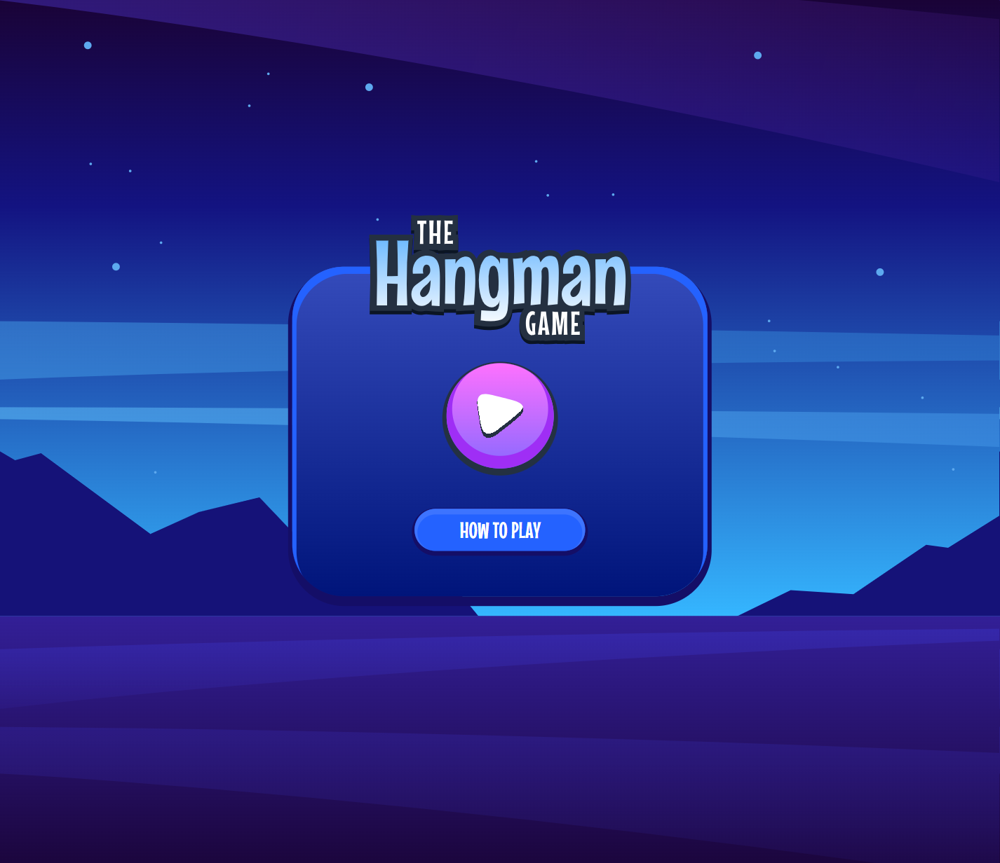
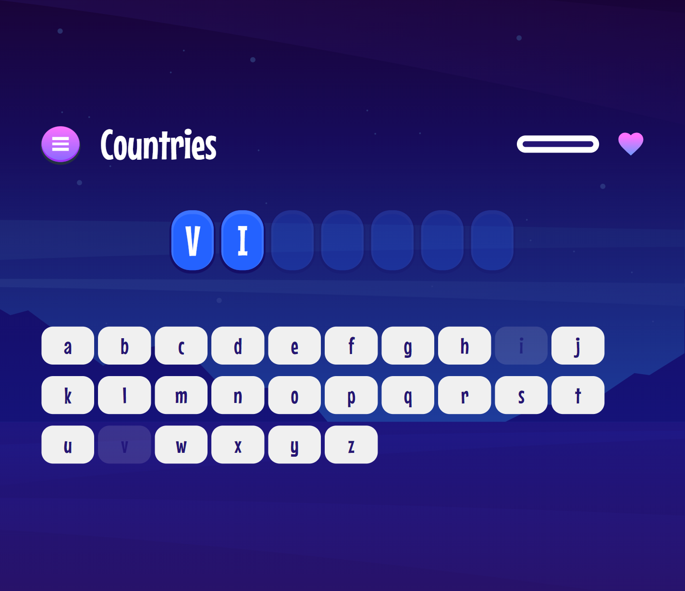

# Frontend Mentor - Hangman game solution

## Overview

### The challenge

Users should be able to:

- Learn how to play Hangman from the main menu.
- Start a game and choose a category.
- Play Hangman with a random word selected from that category.
- See their current health decrease based on incorrect letter guesses.
- Win the game if they complete the whole word.
- Lose the game if they make eight wrong guesses.
- Pause the game and choose to continue, pick a new category, or quit.
- View the optimal layout for the interface depending on their device's screen size.
- See hover and focus states for all interactive elements on the page.
- Navigate the entire game only using their keyboard.

### Screenshot




## My process

### Built with

- Semantic HTML5 markup
- CSS custom properties
- Flexbox
- CSS Grid
- Mobile-first workflow
- [SCSS](https://sass-lang.com/) - CSS preprocessor
- [React](https://reactjs.org/) - JS library
- [Vite](https://vitejs.dev/)- Local dev server & bundler

### What I learned
#### React
In this project I used my knowledge of the react-router-dom library to change different parts of the page, such as changing the menu to select categories, without having to create separate html files. Instead, this project works as a SPA. I also got good practice at creating react composition by dividing parts of the page into separate components. For example, the blocks of letters of a riddle word or the letter keyboard on a game page.

I also practiced using useReducer which gave options to change states without through a single function. It is very convenient for such projects where there are many updating components on one page. 


#### CSS
I also think back to when I first started adding styles to the menu page. At first I couldn't get the right shadow effect on the container and the button. I tried to use pseudo elements and other things, but as it turned out all this matter is solved by border width, which I simply forgot about. 

```css 
/* example: 8px is the border width */
.container {
  box-shadow: inset 0px -10px 0px 8px hsl(274, 91%, 57%)
}
```

### Continued development
I need to continue to develop my component composition skills. I also tried to make the game understandable when using screen readers, but I'm still not quite sure about some things. For example, when I click on the wrong button, the number of attempts is not counted, although I seem to have set the right aria attributes on the progress tag. Also, How else can I clearly let the user know in which position of the word he guessed the letter ?


### Useful resources
- [Net Ninja](https://www.youtube.com/watch?v=OMQ2QARHPo0&list=PL4cUxeGkcC9iVKmtNuCeIswnQ97in2GGf) - A series of tutorials on react router dom. This series uses an older version of the library, but most of the principles are similar.
- [Михаил Непомнящий](https://www.youtube.com/watch?v=0auS9DNTmzE&list=PLiZoB8JBsdznY1XwBcBhHL9L7S_shPGVE) - React router dom v6 (video series in russian)


## Author
- Frontend Mentor - [@DaniilGurski](https://www.frontendmentor.io/profile/DaniilGurski)